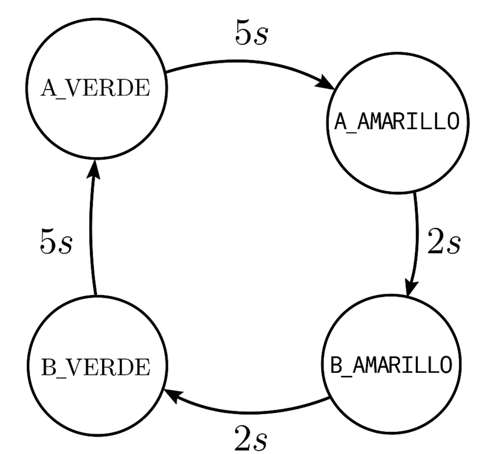

# Práctica 2 – Control de Salidas con FSM (Finite State Machine)

Este repositorio contiene el desarrollo completo de la práctica 2, basada en el uso de máquinas de estados finitas para el control de salidas digitales en el Controllino MEGA. Se divide en dos partes:

---

## 🧩 Parte A: FSM Básica con LEDs

### Objetivo

Diseñar e implementar una FSM que controle una secuencia fija de encendido en 9 LEDs, representando un patrón en espiral sobre una matriz 3x3. Se emplea temporización no bloqueante y punteros para recorrer el arreglo de salidas.

### Contenido

- Código fuente: [`ParteA/P2_RetoA.ino`](./ParteA/P2_RetoA.ino)
- Descripción en [`ParteA/README.md`](./ParteA/README.md)

---

## 🚦 Parte B: FSM para control de semáforos

### Objetivo

Modelar el comportamiento de dos semáforos vehiculares alternados utilizando una FSM. Cada semáforo transita entre estados verde, amarillo y rojo, con tiempos definidos en cada uno.

### Diagrama de estados

### Contenido

- Código fuente: [`ParteB/P2_RetoB.ino`](./ParteB/P2_RetoB.ino)
- Diagrama de estados: [`ParteB/fs2.png`](./ParteB/fs2.png)
- Explicación detallada en [`ParteB/README.md`](./ParteB/README.md)

---

##  📁  Estructura del repositorio

